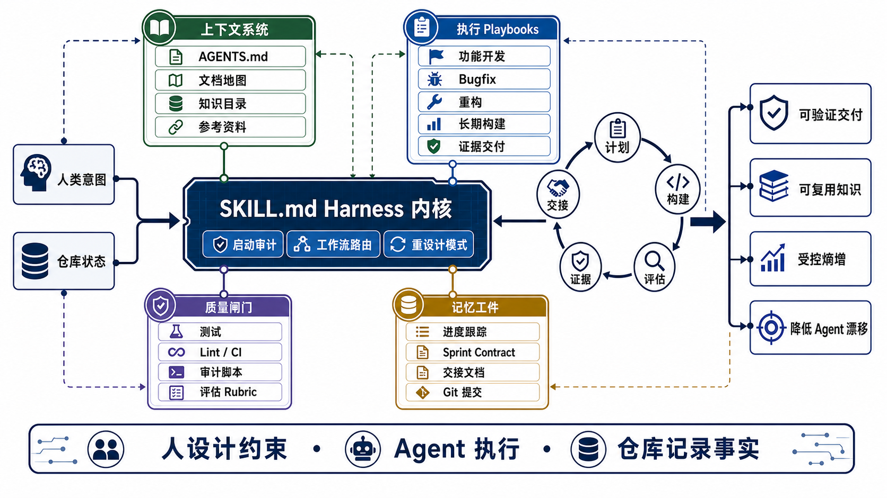

# harness-engineering

[English](README.md) | [简体中文](README.zh-CN.md)

`harness-engineering` 是一个可移植的 Agent Skill，帮助 Codex、Claude Code 以及其他兼容客户端里的 coding agent，在产品开发和项目修改中遵循更可靠的工程实践。

这个 skill 把 OpenAI 的 harness engineering 范式、Anthropic 的多 Agent 研究、社区 Ralph pattern，以及真实长期 Agent 工作中的经验，整理成 agents 可以自动使用的 playbooks、templates、principles 和脚本。

它特别关注证据链、显式 blocker、机器可读的进度跟踪，以及从交付过程中抽取可复用知识。

## 项目总结

本项目把 harness engineering 实践打包成一个可复用 skill。`SKILL.md` 是入口和路由层，负责解释原则、选择工作流和约束 Agent 行为；`playbooks/`、`templates/`、`references/` 和 `scripts/` 则提供具体执行材料，让 Agent 能够规划、构建、评估、交接，并把新知识沉淀到仓库中。

## 架构



这张图表达的是围绕 coding agent 构建的可靠性 harness。`SKILL.md` 是内核：它把任务路由到启动审计、工作流执行或仓库重设计；外层的上下文系统、执行 playbooks、质量闸门和记忆工件共同形成约束系统，让 Agent 的工作可观察、可验证、可交接、可复用。

英文架构图见 [English README](README.md#architecture)。

## 它能做什么

当 skill 被触发时，它会为 Agent 提供：

- **启动审计**：进入新仓库时快速检查基础 harness 表面。
- **工作流路由**：针对新项目、功能开发、长期构建、重构、bugfix 等场景选择 playbook。
- **可直接复用的模板**：包括项目指令文件、交接文档、sprint contract、评估 rubric 和进度跟踪。
- **证据驱动交付**：为里程碑、发布门禁、实验和高风险改动提供可持久化证据。
- **知识治理**：用 catalog-first 检索、轻量条目、成熟度等级和交接沉淀，管理可复用决策、陷阱、流程和领域模型。
- **机械审计助手**：用一个小脚本检查目标仓库是否暴露了 Agent 需要的基础 harness 表面。
- **核心原则**：仓库即事实源、指令文件是地图而非百科、规划/执行/评估分离、基于现实验证、结构化交接、增量提交、知识治理和熵管理。
- **上下文工程**：渐进式披露、上下文重置 vs 压缩、fresh context reliability。
- **多 Agent 模式**：说明何时以及如何使用 Planner / Generator / Evaluator 架构。

## 仓库结构

```text
harness-engineering/
├── README.md
├── README.zh-CN.md
├── .gitignore
├── assets/
│   ├── harness-engineering-architecture-en.png
│   └── harness-engineering-architecture-zh.png
└── harness-engineering/
    ├── SKILL.md                        # 核心 skill：原则、工作流路由和指导
    ├── playbooks/
    │   ├── new-project.md              # 绿地项目启动
    │   ├── feature-development.md      # 现有代码库中的功能开发
    │   ├── long-running-build.md       # 多会话自主构建
    │   ├── refactor-cleanup.md         # 重构和债务治理
    │   ├── bugfix-investigation.md     # Bug 调查工作流
    │   ├── evidence-driven-delivery.md # 提示词到产物的证据工作流
    │   └── knowledge-governance.md     # 可复用知识生命周期
    ├── templates/
    │   ├── AGENTS.md.template          # 项目指令文件模板
    │   ├── handoff-artifact.md         # 会话交接模板
    │   ├── sprint-contract.md          # Sprint contract 模板
    │   ├── evaluator-rubric.md         # 评估标准模板
    │   ├── progress-tracker.json       # JSON 功能进度跟踪模板
    │   ├── knowledge-entry.md          # 可复用知识条目模板
    │   └── knowledge-catalog.md        # Catalog-first 检索模板
    ├── scripts/
    │   ├── harness_audit.py            # 快速 JSON 仓库 harness 审计
    │   └── test_harness_audit.py       # harness_audit.py 单元测试
    └── references/
        └── ecosystem.md                # Harness engineering 生态资料
```

## 安装

把 `harness-engineering/` skill 目录复制到你的客户端会扫描的 skills 目录。

### Codex

个人安装：

```bash
mkdir -p ~/.codex/skills
cp -R harness-engineering ~/.codex/skills/
```

项目安装：

```bash
mkdir -p /path/to/repo/.agents/skills
cp -R harness-engineering /path/to/repo/.agents/skills/
```

### Claude Code

个人安装：

```bash
mkdir -p ~/.claude/skills
cp -R harness-engineering ~/.claude/skills/
```

项目安装：

```bash
mkdir -p /path/to/repo/.claude/skills
cp -R harness-engineering /path/to/repo/.claude/skills/
```

### GitHub Copilot CLI

个人安装：

```bash
mkdir -p ~/.copilot/skills
cp -R harness-engineering ~/.copilot/skills/
```

## 验证

验证 skill 文件夹：

```bash
python3 ~/.codex/skills/.system/skill-creator/scripts/quick_validate.py harness-engineering
python3 harness-engineering/scripts/test_harness_audit.py
```

安装后，可以询问 Agent “what skills are available”，或启动一个涉及项目搭建、代码审查、长期开发的任务。这个 skill 应该会自动触发。

审计目标仓库的 harness 表面：

```bash
python3 harness-engineering/scripts/harness_audit.py /path/to/repo --pretty
```

## 核心概念

| 概念 | 说明 |
|------|------|
| **仓库即事实源** | Agent 需要的信息应该在仓库里；Slack、工单和人的记忆不能作为可靠来源。 |
| **地图，不是百科** | 指令文件应该是约 100 行的导航入口，指向更深层文档。 |
| **知识是护城河** | Harness 让工作流动起来；有类型、有范围、有证据的知识会在工作中复利。 |
| **规划、执行、评估分离** | 不要让同一个 Agent 同时写规格、实现并自我评分。 |
| **让质量可评分** | 把“做得更好”转成具体、加权、可检查的标准。 |
| **基于现实验证** | 测试运行中的产品，而不只是阅读代码。 |
| **证据优先于声明** | 完成需要命令、产物、审查记录或明确 blocker 支撑。 |
| **结构化交接** | 上下文重置加交接文档，通常优于臃肿会话继续硬撑。 |
| **知识持续沉淀** | 可复用决策、陷阱和流程应被编目，并带有证据。 |
| **增量工作** | 一次完成一个功能，频繁提交，并验证每个功能。 |
| **主动管理熵** | Agent 会复制仓库里的模式，包括坏模式。应通过 lint 和 CI 固化好模式。 |
| **复杂度必须有收益** | 每个 harness 组件都代表“模型目前还不能可靠完成某事”的假设，需要持续检验。 |

## Playbooks

| Playbook | 使用场景 |
|----------|----------|
| [New Project](harness-engineering/playbooks/new-project.md) | 从零开始：规格扩展、脚手架、增量构建。 |
| [Feature Development](harness-engineering/playbooks/feature-development.md) | 在现有代码库中增加功能。 |
| [Long-Running Build](harness-engineering/playbooks/long-running-build.md) | 多小时或多会话的自主开发。 |
| [Refactor & Cleanup](harness-engineering/playbooks/refactor-cleanup.md) | 技术债、代码清理和架构改进。 |
| [Bug Investigation](harness-engineering/playbooks/bugfix-investigation.md) | 复现、诊断、测试、修复和防复发。 |
| [Evidence-Driven Delivery](harness-engineering/playbooks/evidence-driven-delivery.md) | 证明里程碑、发布门禁、实验和高风险变更。 |
| [Knowledge Governance](harness-engineering/playbooks/knowledge-governance.md) | 捕获、编目、检索和成熟化可复用项目知识。 |

## 来源

这个 skill 综合了：

- [OpenAI: Harness Engineering](https://openai.com/index/harness-engineering/)：提出 harness engineering 范式的原始文章。
- [Anthropic: Harness Design for Long-Running Apps](https://www.anthropic.com/engineering/harness-design-long-running-apps)：三 Agent 架构。
- [Anthropic: Effective Harnesses for Long-Running Agents](https://www.anthropic.com/engineering/effective-harnesses-for-long-running-agents)：initializer + coding agent 模式。
- [Ralph (snarktank/ralph)](https://github.com/snarktank/ralph)：迭代式 Agent loop。
- [Awesome Harness Engineering](https://github.com/walkinglabs/awesome-harness-engineering)：社区资料集合。
- [deusyu/harness-engineering](https://github.com/deusyu/harness-engineering)：学习档案和概念分析。
- [Harness不是目的，知识才是护城河](https://mp.weixin.qq.com/s/JV4-oPP0jjsBCZ4tW3Gy1g)：知识分层和交付团队知识沉淀实践。

## 兼容性

本仓库遵循开放 Agent Skills 格式：

- Agent Skills quickstart: https://agentskills.io/skill-creation/quickstart
- Agent Skills specification: https://agentskills.io/specification
- Codex skills docs: https://developers.openai.com/codex/skills
- Claude Code skills docs: https://code.claude.com/docs/en/skills

## 贡献

欢迎通过 Issues 和 PR 贡献：

- 改进或新增 playbooks。
- 增强 templates。
- 增加生态参考资料。
- 分享真实使用经验。
- 添加带有清晰范围、证据和成熟度的可复用知识模式。

## 许可证

本仓库使用 MIT License。
